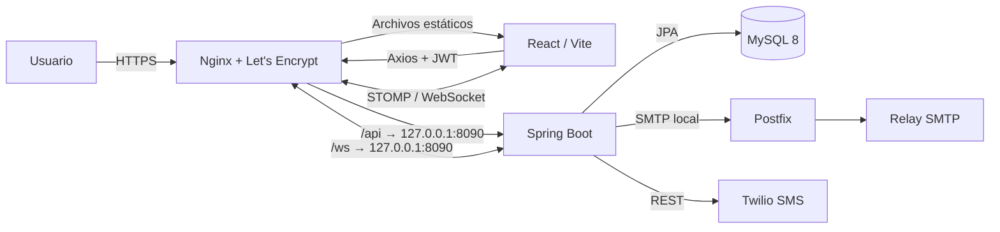

<div align="center">


# AuraMusic

### Plataforma de gestión musical, setlists y teleprompter colaborativo

[](https://openjdk.org/)
[](https://spring.io/projects/spring-boot)
[](https://spring.io/projects/spring-security)
[](https://www.mysql.com/)
[](https://react.dev/)
[](https://vite.dev/)
[](https://nginx.org/)
[](https://www.twilio.com/)

---

**Tecnológico Nacional de México - Instituto Tecnológico de Oaxaca**

| | |
|---|---|
| **Carrera** | Ingeniería en Sistemas Computacionales |
| **Materia** | Programación Web |
| **Proyecto** | Aplicación web full stack |
| **Equipo** | 14 |
| **Integrantes** | Sánchez Chávez Edwin Noé · Sánchez Hernández Diego Alonso |
| **Fecha de entrega** | 30 de julio de 2026 |

### Enlaces de entrega

[](https://auramusic.lat/)
[](https://auramusic.lat/api)
[](https://www.figma.com/proto/s7oFlIuYV5DgC4CicLWw3i/AuraMusic?node-id=0-1&t=KfZjk4YLt9lxOzEn-1)
[](https://github.com/users/noeEdwin/projects/1)

**Aplicación desplegada:** [https://auramusic.lat/](https://auramusic.lat/)  
**URL base de la API:** [https://auramusic.lat/api](https://auramusic.lat/api)  
**Repositorio público:** [https://github.com/noeEdwin/AuraMusic](https://github.com/noeEdwin/AuraMusic)

</div>

---

## Descripción

**AuraMusic** es una aplicación web para músicos, solistas y bandas que centraliza la administración de artistas, canciones, letras, acordes y repertorios. La plataforma facilita la preparación de presentaciones mediante setlists ordenables, métricas musicales, transposición de acordes y un teleprompter con auto-scroll.

Durante una presentación, los integrantes de una banda pueden conectarse a una sesión en vivo mediante WebSocket y mantener sincronizados la canción activa, el estado de reproducción, la posición temporal y la velocidad del teleprompter.

El sistema también proporciona autenticación JWT, tres niveles de acceso, recuperación de contraseña, administración de usuarios, correo transaccional real y SMS de bienvenida.

## Problemática que resuelve

Los músicos suelen distribuir letras, acordes, repertorios y cambios de tono entre mensajes, documentos o aplicaciones diferentes. Esto dificulta mantener una única versión del repertorio y coordinar a todos los integrantes durante una presentación.

AuraMusic concentra ese proceso en una plataforma que permite:

- Mantener un catálogo de artistas y canciones.
- Guardar letras, acordes, BPM, tonalidad y duración.
- Crear repertorios personales o compartidos con una banda.
- Invitar músicos mediante código o enlace.
- Ordenar canciones y configurar pausas y transposición.
- Consultar duración, BPM promedio y tonalidad dominante del setlist.
- Utilizar un teleprompter responsivo durante una presentación.
- Sincronizar una sesión en vivo entre varios dispositivos.
- Administrar usuarios y niveles de acceso de forma segura.

## Objetivo general

Diseñar, desarrollar y desplegar una aplicación web full stack que permita gestionar información musical y coordinar repertorios en vivo, aplicando Spring Boot, React, MySQL, seguridad JWT, migraciones Flyway, pruebas de API, comunicaciones reales y despliegue HTTPS en un VPS.

## Integrantes y contribuciones

| Integrante | Responsabilidades principales |
|---|---|
| **Sánchez Chávez Edwin Noé** | Backend, API REST, Spring Security, JWT, MySQL, Flyway, correo, SMS, WebSocket, Nginx y despliegue en VPS. |
| **Sánchez Hernández Diego Alonso** | Frontend React, diseño responsivo, experiencia de usuario, prototipo Figma, componentes visuales e integración con la API. |
| **Trabajo compartido** | Integración full stack, pruebas con Bruno, revisión funcional, GitHub Projects y preparación de la entrega. |

El historial público de GitHub refleja el trabajo realizado durante el desarrollo:

[Ver historial de commits](https://github.com/noeEdwin/AuraMusic/commits/main/)

### Gestión del proyecto

El repositorio y el tablero son públicos. El trabajo se organiza en GitHub Projects mediante las columnas requeridas:

```text
Backlog → To Do → In Progress → In Review → Done
```

[Abrir tablero público de GitHub Projects](https://github.com/users/noeEdwin/projects/1)

## Roles y niveles de acceso

La tabla `roles` se relaciona con `users` y define tres niveles de acceso.

### Administrador (`ADMIN`)

- Accede a la consola administrativa.
- Consulta métricas generales del sistema.
- Lista, actualiza, activa y desactiva usuarios.
- La desactivación utiliza soft delete mediante `enabled = false`.
- Puede administrar artistas, canciones, bandas y setlists.
- Puede consultar información global del sistema.
- No puede desactivar su propia cuenta administrativa.

### Músico (`MUSICIAN`)

- Administra artistas y canciones propios.
- Crea bandas y queda registrado como líder.
- Invita integrantes mediante código, enlace o correo registrado.
- Administra integrantes e instrumentos de su banda.
- Crea setlists personales o asociados a una banda.
- Participa en sesiones de teleprompter en vivo.

### Solista (`SOLO`)

- Administra artistas y canciones propios.
- Crea setlists personales.
- Utiliza el teleprompter y la transposición.
- Puede unirse a una banda mediante un código de invitación.
- No tiene permiso para crear una banda.

## Credenciales de evaluación

> Esta cuenta está destinada a la evaluación académica. No contiene credenciales de MySQL, SMTP, JWT ni Twilio.

| Rol | Correo | Contraseña |
|---|---|---|
| `ADMIN` | `admin@auramusic.local` | `AuraAdmin1!` |

El seed local también crea usuarios de ejemplo con roles `MUSICIAN` y `SOLO`. El registro público permite crear cuentas nuevas para probar ambos flujos; el rol `ADMIN` no puede registrarse desde el endpoint público.

## Funcionalidades implementadas

| Módulo | Funcionalidades |
|---|---|
| **Autenticación** | Registro, login por correo, JWT, logout, revocación de token, perfil y recuperación de contraseña. |
| **Administración** | Resumen administrativo, listado de usuarios, actualización, activación y soft delete. |
| **Artistas** | CRUD, ownership, búsqueda y paginación del lado del servidor. |
| **Canciones** | CRUD, letras, acordes, álbum, género, BPM, tonalidad, duración, filtros y paginación. |
| **Bandas** | CRUD, líder, integrantes, instrumentos, código de invitación, unión y salida. |
| **Setlists** | CRUD, canciones, ordenamiento, pausas, notas, transposición, duplicación y asociación a banda. |
| **Métricas** | Duración total, BPM promedio, tonalidad dominante y distribución de tonalidades. |
| **Teleprompter** | Letras y acordes, transposición, tamaño de fuente, auto-scroll y velocidades de `0.5x` a `2x`. |
| **Sesión en vivo** | WebSocket/STOMP, canción activa, play, pausa, seek, velocidad compartida y cambio de canción. |
| **Correo** | Bienvenida y recuperación de contraseña mediante JavaMailSender y Postfix. |
| **SMS** | SMS de bienvenida disparado por el registro mediante la API de Twilio. |

### Experiencia frontend

- Rutas públicas y protegidas según el rol autenticado.
- JWT agregado por Axios a las peticiones protegidas.
- Navbar persistente con identidad, avatar, perfil y cierre de sesión.
- Estados de carga y mensajes claros ante fallos de red.
- Formularios de autenticación con validaciones visibles bajo cada campo.
- Confirmaciones con SweetAlert2 para operaciones destructivas.
- Paginación y filtros enviados al backend en los catálogos de artistas y canciones.
- Diseño responsivo para escritorio y dispositivos móviles.

## Tecnologías utilizadas

### Backend

| Tecnología | Uso |
|---|---|
| Java 17 | Lenguaje del backend. |
| Spring Boot 4.1.0 | Base de la aplicación y configuración. |
| Spring Web MVC | API REST y controladores. |
| Spring Security | Autenticación y autorización por rol. |
| JJWT 0.12.6 | Generación y validación de JWT. |
| Spring Data JPA / Hibernate | Persistencia y relaciones entre entidades. |
| Bean Validation | Validaciones declarativas en DTOs. |
| Flyway | Migraciones versionadas del esquema. |
| Spring Mail | Correo transaccional con JavaMailSender. |
| Spring WebSocket | Mensajería STOMP en tiempo real. |
| Maven Wrapper | Compilación y ejecución reproducible. |

### Frontend

| Tecnología | Versión / uso |
|---|---|
| React | 19.2.8 |
| React Router DOM | 7.18.1, rutas públicas y protegidas. |
| Axios | 1.18.1, consumo de API y header JWT. |
| STOMP.js | 7.3.0, cliente WebSocket. |
| SweetAlert2 | 11.26.25, confirmaciones no nativas. |
| Vite | 8.1.5, entorno de desarrollo y build. |
| Oxlint | Análisis estático del frontend. |

### Infraestructura

| Tecnología | Uso |
|---|---|
| MySQL 8.x | Base de datos relacional. No se utiliza MariaDB. |
| Nginx | Archivos estáticos, HTTPS y reverse proxy. |
| systemd | Ejecución persistente del JAR. |
| Certbot / Let's Encrypt | Certificado HTTPS. |
| Postfix | Servidor de correo instalado en el VPS. |
| Brevo SMTP Relay | Entrega saliente desde Postfix por las restricciones SMTP del proveedor del VPS. |
| Twilio | Envío de SMS. |
| Bruno | Pruebas manuales y colección versionada de la API. |

## Arquitectura



En producción, Nginx sirve el build del frontend y dirige `/api/` y `/ws` al backend Spring Boot. El backend se ejecuta como JAR mediante `systemd` y escucha internamente en `127.0.0.1:8090`.

## Base de datos

AuraMusic utiliza **MySQL 8**. Hibernate está configurado con `ddl-auto=validate`, por lo que el esquema no depende de generación automática. Flyway aplica las migraciones al iniciar la aplicación.

### Migraciones

| Migración | Descripción |
|---|---|
| `V1__create_tables.sql` | Tablas iniciales de usuarios, roles, artistas, canciones y playlists. |
| `V2__expand_auramusic_domain.sql` | Bandas, integrantes, setlists, items, tokens y metadatos musicales. |
| `V3__remove_artist_verified.sql` | Simplificación del modelo de artistas. |
| `V4__simplify_song_metadata.sql` | Álbum como texto y simplificación de canciones. |
| `V5__add_user_phone.sql` | Teléfono del usuario. |
| `V6__add_artist_owner.sql` | Ownership de artistas. |

Ubicación:

```text
backend/src/main/resources/db/migration/
```

### Datos de prueba

El perfil `local` ejecuta `DatabaseSeedRunner` cuando la tabla de roles está vacía. El script incluye:

- 3 roles.
- 12 usuarios.
- 10 playlists.
- 3 bandas.
- 9 membresías de banda.
- 4 setlists.

```text
backend/src/main/resources/db/seed/local_seed.sql
```

### Respaldo SQL

El respaldo versionado se encuentra comprimido en:

```text
docs/backups/auramusic_backup_20260728.sql.gz
```

Puede validarse y restaurarse con:

```bash
gzip -t docs/backups/auramusic_backup_20260728.sql.gz
gunzip -c docs/backups/auramusic_backup_20260728.sql.gz | mysql -u USUARIO -p auramusic
```

## Diagrama Entidad-Relación

<div align="center">
  
</div>

Las relaciones muchos a muchos se resuelven mediante tablas asociativas con información adicional:

- `playlists` N:M `songs` mediante `playlist_songs`.
- `bands` N:M `users` mediante `band_members`.
- `setlists` N:M `songs` mediante `setlist_items`.

## Seguridad

- Autenticación mediante correo electrónico y contraseña.
- Contraseñas almacenadas con BCrypt.
- Contraseña mínima de 8 caracteres, una mayúscula, un número y un carácter especial.
- Validación de contraseña en frontend y backend.
- JWT enviado en `Authorization: Bearer <token>`.
- Roles convertidos a autoridades `ROLE_ADMIN`, `ROLE_MUSICIAN` y `ROLE_SOLO`.
- Rutas administrativas protegidas por `SecurityFilterChain`.
- Rutas protegidas en React mediante `ProtectedRoute`.
- Logout con hash del JWT almacenado en `revoked_tokens`.
- Recuperación de contraseña con token aleatorio, hash SHA-256, expiración de 15 minutos y uso único.
- Usuarios desactivados no pueden iniciar sesión ni reutilizar un JWT emitido antes del soft delete.
- DTOs de entrada y salida; las entidades JPA no se exponen directamente.
- Bean Validation mediante `@Valid`, `@NotBlank`, `@Email`, `@Size`, `@Pattern`, `@Min` y `@Max`.
- Errores JSON manejados globalmente con códigos `400`, `401`, `403`, `404`, `409`, `422` y `500`.
- Secretos configurados mediante variables de entorno y fuera del repositorio.

## Requisitos previos

- Git.
- Java 17 o superior compatible.
- MySQL Server 8.x.
- Node.js `20.19+` o `22.12+`.
- npm.
- Bruno para ejecutar la colección de API.
- Opcional: Docker para levantar Mailpit durante pruebas locales.

## Instalación local

### 1. Clonar el repositorio

```bash
git clone https://github.com/noeEdwin/AuraMusic.git
cd AuraMusic
```

### 2. Crear la base de datos MySQL

```sql
CREATE DATABASE auramusic
    CHARACTER SET utf8mb4
    COLLATE utf8mb4_unicode_ci;

CREATE USER 'auramusic'@'localhost'
    IDENTIFIED BY 'CONTRASENA_LOCAL_SEGURA';

GRANT ALL PRIVILEGES ON auramusic.* TO 'auramusic'@'localhost';
FLUSH PRIVILEGES;
```

No es necesario crear tablas manualmente. Flyway ejecutará las migraciones al iniciar el backend.

### 3. Configurar variables del backend

Linux/macOS:

```bash
export SPRING_PROFILES_ACTIVE='local'
export DB_URL='jdbc:mysql://localhost:3306/auramusic?useSSL=false&serverTimezone=UTC&allowPublicKeyRetrieval=true'
export DB_USERNAME='auramusic'
export DB_PASSWORD='CONTRASENA_LOCAL_SEGURA'
export JWT_SECRET="$(openssl rand -base64 48)"
export JWT_EXPIRATION_MS='3600000'
export FRONTEND_BASE_URL='http://localhost:5173'
```

Las variables admitidas están documentadas sin secretos en:

```text
backend/src/main/resources/application.properties.example
```

### 4. Ejecutar el backend

```bash
cd backend
./mvnw spring-boot:run
```

Backend local:

```text
http://localhost:8080
```

API local:

```text
http://localhost:8080/api
```

### 5. Configurar y ejecutar el frontend

En otra terminal:

```bash
cd frontend
cp .env.example .env.local
npm ci
npm run dev
```

Contenido de `.env.local`:

```env
VITE_API_BASE_URL=http://localhost:8080
```

Frontend local:

```text
http://localhost:5173
```

## Variables de entorno

### Backend

| Variable | Descripción | Ejemplo no sensible |
|---|---|---|
| `SPRING_PROFILES_ACTIVE` | Perfil activo. | `local` |
| `DB_URL` | URL JDBC de MySQL. | `jdbc:mysql://localhost:3306/auramusic` |
| `DB_USERNAME` | Usuario MySQL. | `auramusic` |
| `DB_PASSWORD` | Contraseña MySQL. | No versionar |
| `JWT_SECRET` | Secreto JWT de mínimo 32 bytes. | No versionar |
| `JWT_EXPIRATION_MS` | Duración del JWT. | `3600000` |
| `MAIL_HOST` | Host SMTP. | `localhost` |
| `MAIL_PORT` | Puerto SMTP. | `1025` local, `25` con Postfix |
| `MAIL_USERNAME` | Usuario SMTP si aplica. | Vacío con Mailpit/Postfix local |
| `MAIL_PASSWORD` | Contraseña SMTP si aplica. | No versionar |
| `MAIL_SMTP_AUTH` | Habilita autenticación SMTP. | `false` |
| `MAIL_SMTP_STARTTLS` | Habilita STARTTLS. | `false` local |
| `MAIL_ENABLED` | Activa envío de correo. | `true` |
| `MAIL_FROM` | Remitente. | `no-reply@auramusic.lat` |
| `FRONTEND_BASE_URL` | Base para enlaces de recuperación. | `http://localhost:5173` |
| `PASSWORD_RESET_EXPIRATION_MINUTES` | Vigencia del token. | `15` |
| `TWILIO_SMS_ENABLED` | Activa SMS. | `false` local |
| `TWILIO_ACCOUNT_SID` | SID de Twilio. | No versionar |
| `TWILIO_AUTH_TOKEN` | Token de Twilio. | No versionar |
| `TWILIO_SMS_FROM` | Número Twilio. | `+1...` |

### Frontend

| Variable | Descripción | Local | Producción |
|---|---|---|---|
| `VITE_API_BASE_URL` | Origen del backend. | `http://localhost:8080` | `https://auramusic.lat` |

> `VITE_API_BASE_URL` no debe terminar en `/api`, porque los módulos frontend ya incluyen ese prefijo.

## Correo local con Mailpit

Mailpit permite validar los correos sin enviarlos a Internet:

```bash
docker run -d --name mailpit \
    -p 8025:8025 \
    -p 1025:1025 \
    axllent/mailpit
```

Variables:

```bash
export MAIL_ENABLED='true'
export MAIL_HOST='localhost'
export MAIL_PORT='1025'
export MAIL_SMTP_AUTH='false'
export MAIL_SMTP_STARTTLS='false'
export MAIL_FROM='no-reply@auramusic.lat'
```

Bandeja local:

```text
http://localhost:8025
```

## Comunicación con el usuario

### Correo electrónico

El backend envía:

- Correo de bienvenida después del registro.
- Correo de recuperación con enlace temporal.

En producción, Spring Boot entrega el mensaje a Postfix instalado en el VPS. Postfix realiza la entrega saliente mediante un relay autenticado. El dominio `auramusic.lat` utiliza SPF, DKIM y DMARC para autenticar el correo y mejorar la entregabilidad.

Los fallos de correo se registran en logs y no revierten la creación de la cuenta.

### SMS

Al registrarse con un teléfono en formato `+52XXXXXXXXXX`, el backend solicita a Twilio un SMS de bienvenida. La configuración se mantiene únicamente en variables de entorno.

En cuentas Trial, Twilio exige verificar previamente el número de destino. El error `21608` indica que el destinatario todavía no está verificado.

Los fallos de SMS tampoco revierten el registro.

### Alcance acordado

La comunicación requerida para la entrega comprende correo electrónico real y SMS. WhatsApp no forma parte del alcance final acordado del proyecto.

## API REST

Las rutas públicas son login, registro y recuperación. El resto requiere:

```http
Authorization: Bearer <token>
```

### Autenticación

| Método | Ruta | Descripción |
|---|---|---|
| `POST` | `/api/auth/register` | Registrar `MUSICIAN` o `SOLO`. |
| `POST` | `/api/auth/login` | Autenticar por correo y obtener JWT. |
| `GET` | `/api/auth/me` | Consultar usuario autenticado. |
| `PUT` | `/api/auth/profile` | Actualizar perfil y renovar sesión. |
| `POST` | `/api/auth/logout` | Revocar JWT. |
| `POST` | `/api/auth/forgot-password` | Solicitar recuperación. |
| `POST` | `/api/auth/reset-password` | Establecer nueva contraseña. |

### Administración

Todas estas rutas requieren rol `ADMIN`.

| Método | Ruta | Descripción |
|---|---|---|
| `GET` | `/api/admin/summary` | Resumen administrativo. |
| `GET` | `/api/admin/users` | Listar usuarios. |
| `PUT` | `/api/admin/users/{id}` | Actualizar usuario. |
| `PUT` | `/api/admin/users/{id}/activate` | Reactivar usuario. |
| `DELETE` | `/api/admin/users/{id}` | Soft delete (`enabled=false`). |

### Artistas

| Método | Ruta | Descripción |
|---|---|---|
| `GET` | `/api/artists?name=&page=&size=` | Buscar y paginar. |
| `GET` | `/api/artists/{id}` | Consultar artista. |
| `POST` | `/api/artists` | Crear artista. |
| `PUT` | `/api/artists/{id}` | Actualizar artista. |
| `DELETE` | `/api/artists/{id}` | Eliminar artista. |

### Canciones

| Método | Ruta | Descripción |
|---|---|---|
| `GET` | `/api/songs?title=&genre=&artistId=&ownerId=&page=&size=` | Buscar y paginar. |
| `GET` | `/api/songs/{id}` | Consultar canción. |
| `POST` | `/api/songs` | Crear canción. |
| `PUT` | `/api/songs/{id}` | Actualizar canción. |
| `DELETE` | `/api/songs/{id}` | Eliminar canción. |

### Bandas

| Método | Ruta | Descripción |
|---|---|---|
| `GET` | `/api/bands` | Listar bandas visibles. |
| `GET` | `/api/bands/{bandId}` | Consultar banda. |
| `POST` | `/api/bands` | Crear banda. |
| `PUT` | `/api/bands/{bandId}` | Actualizar banda. |
| `DELETE` | `/api/bands/{bandId}` | Eliminar banda. |
| `GET` | `/api/bands/{bandId}/members` | Listar integrantes. |
| `POST` | `/api/bands/{bandId}/members` | Agregar por correo. |
| `POST` | `/api/bands/join` | Unirse con código. |
| `PUT` | `/api/bands/{bandId}/members/{memberId}` | Actualizar instrumento. |
| `DELETE` | `/api/bands/{bandId}/members/{memberId}` | Remover integrante o abandonar banda. |

### Setlists

| Método | Ruta | Descripción |
|---|---|---|
| `GET` | `/api/setlists` | Listar setlists visibles. |
| `GET` | `/api/setlists/{id}` | Consultar setlist y métricas. |
| `POST` | `/api/setlists` | Crear setlist. |
| `PUT` | `/api/setlists/{id}` | Actualizar setlist. |
| `DELETE` | `/api/setlists/{id}` | Eliminar setlist. |
| `POST` | `/api/setlists/{id}/items` | Agregar canción. |
| `PUT` | `/api/setlists/{id}/items/reorder` | Reordenar canciones. |
| `PUT` | `/api/setlists/{id}/items/{itemId}` | Actualizar item. |
| `DELETE` | `/api/setlists/{id}/items/{itemId}` | Quitar canción. |
| `POST` | `/api/setlists/{id}/duplicate` | Duplicar repertorio. |

## WebSocket y sesiones en vivo

Endpoint local:

```text
ws://localhost:8080/ws
```

Endpoint de producción:

```text
wss://auramusic.lat/ws
```

El JWT se envía en el frame STOMP `CONNECT`:

```text
Authorization: Bearer <token>
```

Destinos:

```text
Suscripción: /topic/bands/{bandId}/state
Comandos:    /app/bands/{bandId}/command
```

Comandos soportados:

```json
{ "type": "START_SESSION", "setlistId": 1, "activeItemId": 1 }
{ "type": "SYNC_REQUEST" }
{ "type": "PLAY" }
{ "type": "PAUSE" }
{ "type": "CHANGE_SONG", "activeItemId": 2 }
{ "type": "SEEK", "positionMillis": 90000 }
{ "type": "SET_RATE", "playbackRate": 1.25 }
{ "type": "CLOSE_SESSION" }
```

La posición se representa en milisegundos, no en píxeles. Cada dispositivo convierte el mismo tiempo a un porcentaje de scroll según su pantalla y tamaño de fuente.

## Diseño en Figma

El prototipo navegable contiene las pantallas principales de autenticación, catálogo, bandas, setlists, teleprompter y administración.

[Abrir prototipo de AuraMusic en Figma](https://www.figma.com/proto/s7oFlIuYV5DgC4CicLWw3i/AuraMusic?node-id=0-1&t=KfZjk4YLt9lxOzEn-1)

### Paleta y teoría del color

- **Violeta:** creatividad, identidad artística e imaginación.
- **Cian:** tecnología, sincronización, claridad e interacción en vivo.
- **Fondos oscuros:** reducen distracciones y mejoran la lectura del teleprompter en escenarios con poca luz.
- **Contrastes claros:** facilitan jerarquía, accesibilidad y lectura rápida durante una presentación.

El logo original y el lenguaje visual implementado mantienen coherencia con el prototipo.

## Pruebas de API con Bruno

La colección está versionada directamente en:

```text
bruno-collection/
```

Incluye ambientes:

```text
bruno-collection/environments/local.bru
bruno-collection/environments/production.bru
```

Cobertura principal:

- Login y captura de JWT.
- Registro de músico y solista.
- Rechazo de registro administrativo.
- Peticiones protegidas con token.
- Casos `401`, `403`, `404` y `422`.
- Recuperación de contraseña y token reutilizado.
- CRUD de artistas y canciones.
- Filtros y paginación.
- Bandas, integrantes y códigos de invitación.
- Setlists, items, ordenamiento y duplicación.

Flujo recomendado:

1. Abrir `bruno-collection` en Bruno.
2. Seleccionar `local` o `production`.
3. Ejecutar `Auth/01 Login admin`.
4. Bruno guarda el JWT como variable de colección.
5. Ejecutar las peticiones protegidas.
6. Ejecutar los casos de error intencionales.

No se utiliza Postman y ningún JWT real está versionado.

## Validaciones y manejo de errores

El registro valida en frontend y backend:

- Correo válido.
- Teléfono mexicano internacional `+52` seguido de 10 dígitos.
- Contraseña con mínimo 8 caracteres.
- Al menos una mayúscula.
- Al menos un número.
- Al menos un carácter especial.

Los formularios de autenticación muestran errores bajo los campos. Las operaciones destructivas utilizan SweetAlert2; no se utilizan `alert()` ni `confirm()` nativos.

Las respuestas de error tienen formato JSON:

```json
{
  "timestamp": "2026-07-29T18:14:43Z",
  "status": 401,
  "error": "Unauthorized",
  "message": "La autenticacion es requerida",
  "path": "/api/admin/summary"
}
```

## Compilación y pruebas

### Backend

```bash
cd backend
./mvnw test
./mvnw clean package
```

La suite actual contiene pruebas unitarias e integradas para autenticación, seguridad, catálogo, bandas, setlists, administración, correo, SMS y sesiones en vivo.

### Frontend

```bash
cd frontend
npm ci
npm run lint
npm run build
```

La salida de producción se genera en:

```text
frontend/dist/
```

## Despliegue en VPS

### Backend

Compilar y subir:

```bash
cd backend
./mvnw clean package
scp target/backend-0.0.1-SNAPSHOT.jar root@SERVIDOR:/tmp/backend.jar
```

Instalar en el VPS:

```bash
cp /opt/auramusic/backend.jar \
   /opt/auramusic/backend.jar.backup-$(date +%Y%m%d-%H%M%S)

install -o auramusic-app -g auramusic-app -m 640 \
    /tmp/backend.jar /opt/auramusic/backend.jar

systemctl restart auramusic
systemctl status auramusic --no-pager
journalctl -u auramusic --no-pager -n 100
```

El JAR se mantiene activo mediante `auramusic.service` y escucha internamente en el puerto `8090`.

### Frontend

El origen API se incorpora durante el build:

```bash
cd frontend
npm ci
VITE_API_BASE_URL=https://auramusic.lat npm run build
tar -C dist -czf /tmp/auramusic-frontend.tar.gz .
```

El contenido de `dist` se publica en el directorio estático configurado en Nginx. Los assets de Vite incluyen hashes; `index.html` debe servirse sin caché para que los clientes reciban cada versión nueva.

Configuración recomendada:

```nginx
location /assets/ {
    try_files $uri =404;
    expires 1y;
    add_header Cache-Control "public, immutable";
}

location / {
    try_files $uri $uri/ /index.html;
    add_header Cache-Control "no-cache, no-store, must-revalidate" always;
}

location /api/ {
    proxy_pass http://127.0.0.1:8090;
}
```

Antes de recargar Nginx:

```bash
nginx -t
systemctl reload nginx
```

### HTTPS

El dominio utiliza un certificado gratuito de Let's Encrypt configurado con Certbot. La aplicación, la API y el WebSocket se sirven sobre HTTPS/WSS.

```text
https://auramusic.lat/
https://auramusic.lat/api
wss://auramusic.lat/ws
```

## Estructura del repositorio

```text
AuraMusic/
├── backend/
│   ├── pom.xml
│   ├── src/main/java/com/auramusic/backend/
│   ├── src/main/resources/db/migration/
│   ├── src/main/resources/db/seed/
│   └── src/test/java/com/auramusic/backend/
├── frontend/
│   ├── package.json
│   ├── public/
│   └── src/
├── bruno-collection/
├── docs/
│   └── backups/
├── README.md
└── .gitignore
```

## Estado del alcance

| Área | Estado |
|---|---|
| Backend Spring Boot | Implementado |
| Frontend React responsivo | Implementado |
| MySQL + Flyway | Implementado |
| Tres roles y JWT | Implementado |
| CRUD de módulos principales | Implementado |
| Paginación y filtros de catálogo | Implementado |
| Recuperación de contraseña | Implementado |
| Correo real | Implementado |
| SMS | Implementado |
| Teleprompter WebSocket | Implementado |
| Figma navegable | Disponible |
| Bruno versionado | Disponible |
| VPS + HTTPS | Desplegado |

## Consideraciones operativas

- Las sesiones WebSocket se mantienen en memoria y se reinician cuando se reinicia el backend.
- Una cuenta Trial de Twilio solo puede enviar SMS a destinatarios verificados.
- Los secretos reales del VPS se almacenan fuera del repositorio.
- La credencial administrativa publicada se utiliza exclusivamente para evaluación.
- El frontend y backend deben desplegarse juntos cuando cambia el contrato WebSocket.

## Enlaces

- **Aplicación:** [https://auramusic.lat/](https://auramusic.lat/)
- **API:** [https://auramusic.lat/api](https://auramusic.lat/api)
- **Repositorio:** [https://github.com/noeEdwin/AuraMusic](https://github.com/noeEdwin/AuraMusic)
- **Figma:** [Prototipo navegable de AuraMusic](https://www.figma.com/proto/s7oFlIuYV5DgC4CicLWw3i/AuraMusic?node-id=0-1&t=KfZjk4YLt9lxOzEn-1)
- **GitHub Projects:** [Tablero público del Equipo 14](https://github.com/users/noeEdwin/projects/1)
- **Historial de commits:** [Commits de main](https://github.com/noeEdwin/AuraMusic/commits/main/)

---

<div align="center">

**AuraMusic · Equipo 14 · Programación Web · Julio 2026**

</div>
